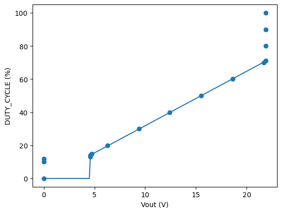
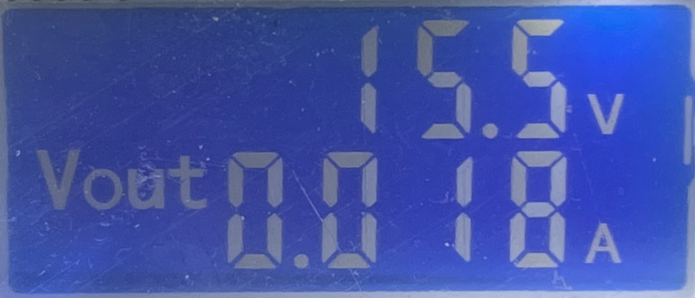
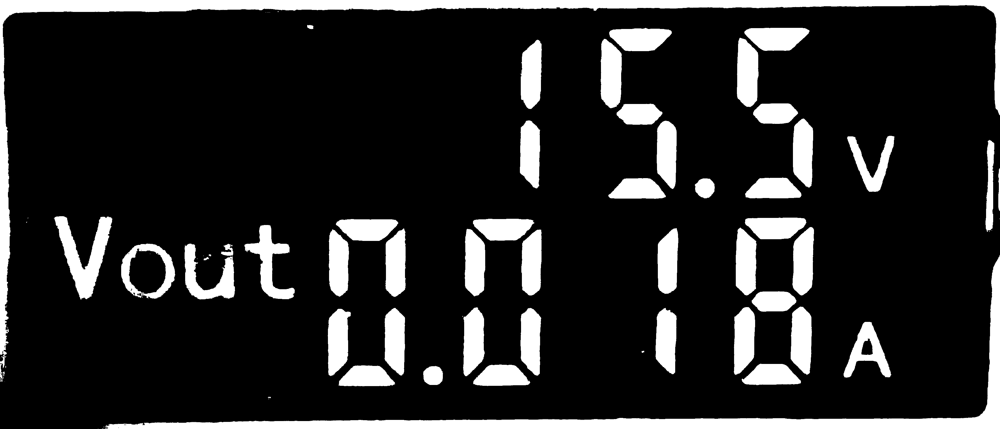

#  NCSLab 


## Installation

- Install [`Node.js`](https://nodejs.org/en/download/package-manager)

- Install [`three.js`](https://threejs.org/docs/index.html#manual/en/introduction/Installation) and a build tool [`Vite`](https://threejs.org/docs/index.html#manual/en/introduction/Installation)


## Launch

```bash
python3 workspace/main.py
python3 workspace/mjpeg_server.py
```


## Patent

- [一种基于HTML5的电路虚拟实验系统](reference/patent/一种基于HTML5的电路虚拟实验系统.pdf)：[simu] 用户通过平面和3D绘制模型模块，可以根据需要手动绘制平面电路模型
- [一种基于数字孪生技术的电路实验教学系](reference/patent/一种基于数字孪生技术的电路实验教学系.pdf)：[simu + real] 通过对仿真电路的修改反馈到可编程逻辑控制器开关，从而改变实物电路连接
- [一种基于网络化控制的风扇速度控制在线](reference/patent/一种基于网络化控制的风扇速度控制在线.pdf)：[simu + real] 
- [一种虚拟电路实验室及其制作方法、使用方法](reference/patent/一种虚拟电路实验室及其制作方法、使用方法.pdf)：[simu] 使用FPGA和Arduino结合实现暂态仿真实验的简便运行
- [一种远程控制的电子电路实验系统](reference/patent/一种远程控制的电子电路实验系统.pdf)：
- [远程在线共享网络实验室的虚-实组合互动实现方法](reference/patent/远程在线共享网络实验室的虚-实组合互动实现方法.pdf)：[simu + real] 基于真实组网环境的虚拟组网实验平台


### PWM波控制可变电源

输出电压与PWM波占空比关系如下：



参考：
- [PWM原理 PWM频率与占空比详解](https://blog.csdn.net/as480133937/article/details/103439546)

输出电流稳定在20mA。


## Picamera2

update:2024.6.14
下面这个方案已废弃

update:2024.5.17
先运行/src/online/Camera_test/server_camera.py 在localhost:8091/video_feed下开启视频流
然后/src/online/main.py 运行主网页

Reference
- ⭐️ https://github.com/barry-ran/raspberry-webcam
- ⭐️ [How to Install & Setup OpenCV on Raspberry Pi 4](https://how2electronics.com/how-to-install-setup-opencv-on-raspberry-pi-4)
- ⭐️ https://github.com/raspberrypi/picamera2/blob/main/examples/preview.py
- [Installing OpenCV on Raspberry Pi 4B](https://www.youtube.com/watch?v=OugQIz_vcFo)


## 识别电压电流数据

测试图片如下：



注意到，底色和内容颜色都是单一的，因此我们首先通过二值化将两者分离开来。




## Release Note

- v2.1.4:
    - fix issue #11 #12 #19
- v2.1.3: 
    - self defined `html` & `js`
- v2.1.2:
  - `rectangle-module` and `submit`
- v2.1.1:
  - support video streaming
- v2.1.0: 
  - support continuous channel switch
  - support check for invalid input


## Contributor

- 电路设计：郝熙哲、汤竑敬
- 网页设计：华羽霄、钟梓轩
- 专利撰写：华羽霄、郝熙哲、张艺峰
- 专利申请：郝熙哲、华羽霄、张艺峰
